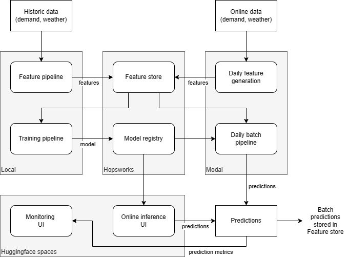

# Project - Predicting Daily Electricity Demand in New York, USA

The project is a machine learning prediction service that predicts the daily electricity demand in megawatthours in New York, USA. 

As features, the project uses historical daily demand, daily average temperature (celsius), and whether the date was a US Federal holiday or not. 

Training data consists of the years 2017 - 2021. The data for historical daily demand is obtained from [US Energy Information Administration (EIA)](https://www.eia.gov/) ([Link to API](https://www.eia.gov/opendata/browser/electricity/rto/daily-region-data)) and the data for historical average daily temperature is obtained from [National Oceanic and Atmospheric Administration (NOAA)](https://www.noaa.gov/). The US Federal holidays are obtained from the `USFederalHolidayCalendar` library in `pandas.tseries.holiday`. The temperature data for the daily scheduled batch predictions is obtained from [WeatherAPI](https://api.weatherapi.com/).

Along with the model's predictions we also provide the forecasted demand from EIA and find that our model's predicted values turn out to be fairly close to those of the official EIA forecast.

### Links

TODO: short description of UIs

- Monitoring dashboard
    - https://rscolati-electricity-monitoring.hf.space/
- Interactive prediction service
    - https://rscolati-electricity.hf.space/

## Pipelines

The prediction service is built using separate feature, training and inference pipelines, as described below. Hopsworks is used as feature store and model registry, daily instance generation and batch inference are deployed as functions in Modal and the UIs for online inference and monitoring are implemented using Hugginface spaces. The service architecture is (roughly) described in the following diagram.   

The source code for the feature, training, and inference pipelines as well as for the monitoring and online inference interfaces is implemented in [proj](.), and the main parts are briefly described below.  

### Feature pipeline 

Implemented in [`feature.ipynb`](feature.ipynb) as a Jupyter notebook.

TODO: short description  (data/features used etc.)

### Training pipeline

Implemented in [`training.ipynb`](training.ipynb) as Jupyter notebook.

TODO: short description (data prep pipeline, tuning, model&training)

### Daily instance generation

Implemented as Modal function in [`feature-daily.py`](feature-daily.py).

TODO: short description 

### Daily batch inference pipeline

Implemented as Modal function in [`batch-daily.py`](batch-daily.py).

TODO: short description

## Model

TODO: can be briefly described in [Training](#training-pipeline)?